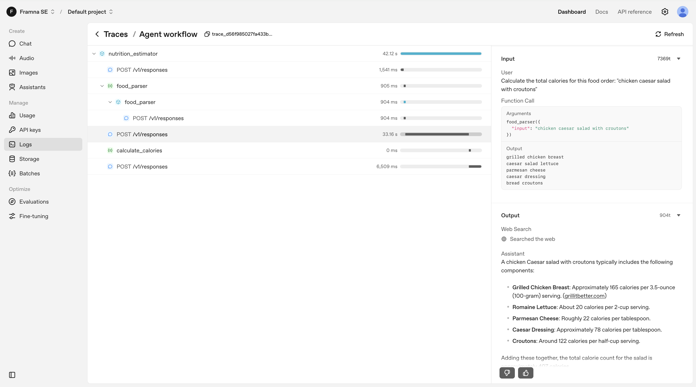

# Meal Nutrition Estimator Agent Lab

## Learning Objectives

- Building a multi-agent systems using OpenAI Agents SDK
- Orchestrate tools: WebSearch, calculator functions, and agent-as-tool patterns  
- Understanding the usefulness of dividing a problem into smaller problems, each solvable by a specialist tool/agent

## The Challenge

Create a **Meal Nutrition Estimator Agent** that processes complex food orders and returns total calories with health context.

**Example Input:** "Big Mac + medium fries + Coke"  
**Expected Output:** "That's about 850 calories total, a hearty meal."

Build the system by implementing:

1. **Calculator tools** (`tools.py`) - Sum calories and categorize health impact
2. **Parser agent** (`parser_agent.py`) - Break complex orders into searchable items  
3. **Main agent** (`nutrition_agent.py`) - Orchestrate all tools with clear instructions
4. **CLI interface** (`main.py`) - Process sample queries and display results

## System Architecture

### Why This Multi-Agent Approach?

A single agent trying to parse orders, search nutrition data, and calculate totals easily becomes overwhelmed and error-prone. The example is a toy example but it shows how specialized agents and tools can work together to handle different aspects of a problem.

### 1. Food Parser Agent
This agent breaks complex orders into searchable nutrition items  

```python
# Input: "Big Mac meal"
# Output: ["Big Mac", "McDonald's medium fries", "medium Coca-Cola"]

parser_agent = Agent(
    name="food_parser",
    instructions="""
    You are a food parsing specialist. Break complex orders into individual items.
    - "Thai curry with rice" → ["Thai green curry", "jasmine rice portion"]
    - Include restaurant chains when mentioned
    - Specify portion sizes when available
    """
)
```

### 2. Web Search Tool  
We use a search tool to find nutrition data for individual food items that an LLM otherwise will be prone to hallucinate.

```python
# Search strategy in main agent instructions:
# - Search for "{food item} calories nutrition facts"
# - Prefer USDA database, official restaurant data
# - Extract "calories per serving" carefully
```

### 3. Calculator Tool
We want to use a tool to sum calories since LLMs are very bad at arithmetics. We also provide a health categorization with advice as a fun extension of the tool.

```python
from agents import function_tool
from pydantic import BaseModel

class NutritionResult(BaseModel):
    total_calories: int
    health_category: str  # "light", "moderate", "heavy"
    health_advice: str

@function_tool
def calculate_calories(calorie_list: List[int]) -> NutritionResult:
    total = sum(calorie_list)
    category = "light" if total < 400 else "moderate" if total < 800 else "heavy"
    advice = get_health_advice(total)
    return NutritionResult(total, category, advice)
```

### 4. Main Nutrition Agent
The main agent is the entry point of the system and orchestrate calls to other agents and tools to complete the full workflow. The state handling and calling logic is abstracted by the OpenAI SDK, meaning you mainly need to focus on the instructions to the AI.

```python
nutrition_agent = Agent(
    name="nutrition_estimator",
    # These instructions set the agenda of the task at hand and is
    # what will control the approach and when the system consider
    # itself finished with the task
    instructions="""
    Your workflow:
    1. Use food_parser tool to break complex orders into items
    2. Use web_search to find nutrition data for each item  
    3. Extract calorie numbers from search results
    4. Use calculate_calories to sum totals and get health advice
    5. Format results clearly with breakdown and advice
    """,
    # Supply tools (and agents) below to let the agent
    # solve the workflow describe in the instructions
    tools=[
        parser_agent.as_tool(tool_name="food_parser"),
        WebSearchTool(),
        calculate_calories
    ]
)
```

## Expected Workflow

1. **User Input:** "Thai green curry with jasmine rice"
2. **Parser Agent:** → ["jasmine rice portion", "coconut milk", "Thai basil", "chicken breast"] 
3. **Web Search:** Find calories for each item from nutrition databases online
4. **Calculator:** Sum calories (420 + 230 = 650) and give e.g. "moderate" category
5. **Health Context:** "Balanced meal. Appropriate for most people"

**Sample Output:**
```
🥘 Thai green curry with jasmine rice
Total: 650 calories

📊 That's a moderate-calorie restaurant meal.
💡 Balanced meal - appropriate for most people's daily intake.
```

## Tracing
The agents are making multiple calls under the hood that's not seen in the code. All this can be "traced" in the OpenAI log console: https://platform.openai.com/logs?api=traces


